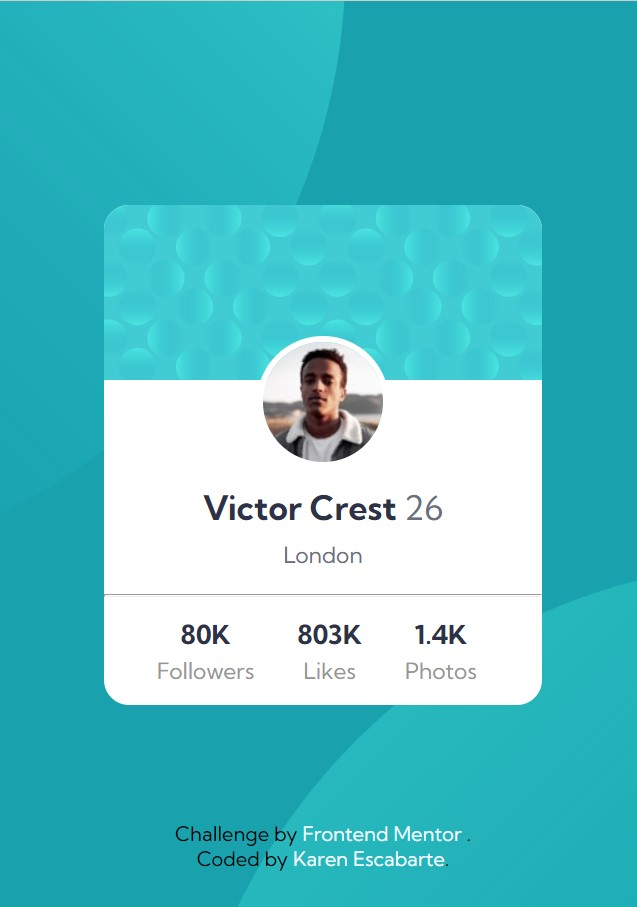

# Frontend Mentor - Profile card component

## Welcome! 👋

Thanks for checking out this front-end coding challenge.

[Frontend Mentor](https://www.frontendmentor.io). Frontend Mentor challenges help me to improve my coding skills by building realistic projects. 

**To do this challenge, you need a basic understanding of HTML and CSS.**

## Table of contents

- [Overview](#overview)
  - [The challenge](#the-challenge)
  - [Screenshot](#screenshot)
  - [Links](#links)
- [My process](#my-process)
  - [Built with](#built-with)
  - [What I learned](#what-i-learned)
- [Author](#author)
- [Acknowledgments](#acknowledgments)

## Overview

The Challenge was about making a profile card component and get it look as close to the design as possible.

### The challenge

- Build out the project to the designs provided

### Screenshot

### Links

- Solution URL: (https://github.com/karenescabarte/Profile-card-component)
- Live Site URL: (https://karenescabarte.github.io/Profile-card-component/)

## My process
This challenge was made by the help of HTML5 and CSS3. 

### Built with

- Semantic HTML5 markup
- CSS custom properties
- Flexbox

### What I learned
I learned how to manipulate the svg using absolute position

## Author

- Website - [Karen C. Escabarte](https://github.com/karenescabarte)

## Acknowledgments

I would like to thank myself for making this little challenges, because it helps me a lot to recap for the things that Ive learned in the HTML5 and CSS3.

